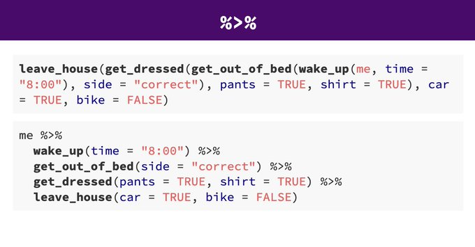

```{r setup, include=FALSE}
knitr::opts_chunk$set(echo = TRUE, warning=FALSE, message=FALSE)
```

## Objectives

- Learn how to use `dplyr` to clean and wrangle your data.
- Learn how to plot with `ggplot2`


**Acknowledgements** 

This tutorial is adapted from Dr. Emily Burchfield's fantastic tutorial on [Data Management](https://eburchfield.github.io/files/2_describing_data_lab.html). 

## Set-up 

This tutorial will make use of the `gapminder` package again. Start by loading the package and the `gapminder` data.


```{r gapminder, results = "hide"}

library(gapminder)
data(gapminder)

```

You’ll also want to be sure to install and load the `tidyverse` package. This is a suite of packages that includes `dplyr` and `ggplot2`. 

```{r tidyverse}

library(tidyverse)

```

We already are familiar with this dataset so let's get right into it.


## Subsetting and more using `dplyr` 

The `dplyr`package is one of a number of packages in the `tidyverse` set of packages that makes data wrangling, indexing, and plotting much easier. In this class, we’ll frequently use this set of packages. Yes, you can do the same things using base `R`, but while they may seem a bit trickier initially, the tools in the `tidyverse` are extremely powerful and worth learning. Not convinced? [Check this out](http://varianceexplained.org/r/teach-tidyverse/).

Instead of indexing with `[,]`, `$` and other symbols, `dplyr` contains several functions that make data organization much simpler:

- `select()`: choose columns
- `filter()`: choose rows
- `arrange()`: order or arrange rows
- `mutate()`: create new columns
- `summarize()`: summarize values (for the Brits in the room, you can also use `summarise()`)
- `group_by()`: group observations by a shared value

### Create a `gapminder` subset

Ok, let’s create the same Sri Lanka dataset with year and GDP per capita that we made last week using *base R*, but this time we'll use `dplyr` code. Don’t forget to load either the `tidyverse` package which contains `dplyr` (`library(tidyverse)`) or just `dplyr` using `library(dplyr)` if you haven’t already:

```{r sri_lanka}

sri_lanka_gdp <- gapminder %>%
  filter(country == "Sri Lanka") %>%
  select(year, gdpPercap)

head(sri_lanka_gdp)

```

A few things are happening here. First, you’re probably wondering what that crazy `%>%` thing is. We’ll get there. 


First, let’s look at the two functions I’m using to create the dataset. Since we only care about Sri Lanka, we start by `filter`ing out the rows in which `country=="Sri Lanka"`. We then `select` the columns we’re interested in, `year` and `gdpPercap`. Notice that when using `select()` we do not need to use quotes around our column names, `dplyr` already knows that it should be looking for column names, and that they are contained as character strings. We also do not need to provide the name of the dataset in `select()` as in (`gapminder$year`) as `dplyr` 

</br>
So what is the `%>%` thing about? This is called a **pipe**. This allows you to *send* the **output** of one function to the **input** of another. 

</br>

In this example, we start with the full `gapminder` dataset. We send the **full** dataset into the the `filter()` function, which keeps only rows where the value in the `country` column is `"Sri Lanka"`. We then send this new Sri Lankan data subset into the `select()` function to choose only columns of interest to us. This keeps us from having to create two separate `data.frames` or from complicated indexing (i.e. `c("gdpPercap", "year")`, etc...). 


It also is very easy for other `R` programmers to read because it reads like plain old English. (You may see `dplyr` called a "*grammer of data manipulation*", complete with *verbs* that describe data manipulation actions.) When you write code using `dplyr` structure you can basically read the code as you would a sentence of text. 


For example try reading the second block of code in the image below.

<center>

This should read as something like *"I wake up at 8 o'clock, then I get out of bed on the correct side, then I get dressed by putting on pants and a shirt, then I leave the house in my car."*

Try doing the same with the first block of code... Not happening, right? </center>
</br>

Grammatically, I tend to think of the **pipe** as the word **"then"**. Check out [Section 18 of R for Data Science](https://r4ds.had.co.nz/pipes.html) for more on pipes.


Notice that when using `select()` we do not need to use quotes around our column names, `dplyr` already knows that it should be looking for column names, and that they are contained as character strings. We also do not need to provide the name of the dataset in `select()` as in (`gapminder$year`) as `dplyr` knows what dataset we are working with already and will automatically assume you are selecting from that.

### Aggregate subset

Not convinced yet that this trumps base `R`? Ok, say you want to know the average, maximum, and minimum GDP for Sri Lanka over the last 50 years. No problem:

```{r Sri_lanka_summary}

gapminder %>%
  filter(country == "Sri Lanka") %>%
  select(year, gdpPercap) %>%
  summarize(avg_gdp = mean(gdpPercap), max_gdp = max(gdpPercap), min_gdp = min(gdpPercap))

```

The `summarize()` function takes all rows in each column and applies a function to these rows. `mean(gdpPercap)` takes the mean of all observations of `gdpPercap` for Sri Lanka and returns the average, summarized as the new variable `avg_gdp`.

Try putting this in plain English using the "*grammar of `dplyr`*". Then unfold the code chunk below to see what I think the code says.


```{r grammar, class.source = 'fold-hide'}

# Start with the gapminder dataset, then filter to only records for the country of Sri Lanka, then remove all columns except for year and gdpPercap, then summarize the Sri Lanka data subset so that we return a dataframe with three newly created columns (avg_gdp, max_gdp, and min_gdp) that describe the average, maximum, and minimum of gdpPercap across all records for Sri Lanka.

```

Let’s go a bit further. Let’s say you want to know which countries have the highest average life expectancy:

```{r life_exp}

gapminder %>%
  group_by(country) %>%
  summarize(mean_le = mean(lifeExp)) %>%
  arrange(desc(mean_le))

```


Notice the use of the `group_by()` function. **This is an important step.** 


It groups the data by country (you could also group by year or any other categorical variable) and then applies the function specified in the `summarize()` function to **each group of data**, in our case, to each `country`. We use the function `mean()`, but you can apply any function you can find (or build!) to this grouped data. 


So what is `arrange()` doing? It takes as its input the summarized life expectancy dataset, which should contain a column for `country` and a column for `mean_le` and then orders the dataset by values in `mean_le`. `desc()` is another `dplyr` function that just says that a vector should be sorted in *descending* order. To sort in *ascending* order just drop the `desc()` inside the `arrange()` function. 


I find the `dplyr` code simpler and much easier to read than answering the same question using *base R*, and this is why we as a class will invest time and energy in learning the ways of the `tidyverse`. 


I should add, however, that I’m a big proponent of the **you do you** philosophy, so if you feel strongly attached to *base R* and choose to use *base R* to work with your data, you do you. I’ll also say that on big projects, you tend to use a bit of both, so be sure you’ve reviewed the *base R* resources provided last week.

### Creating variables

What if we want to add a new variable to our dataset? Let's try recreating the Africa indicator we made last week, but this time using the `mutate()` function in `dplyr`. `mutate()` allows us to easily add new variables to our `dataframe`.

```{r mutate}

africa <- gapminder %>%
  mutate(africa = ifelse(continent == "Africa", 1, 0))

head(africa)

```

This creates a new `dataframe` to which I’ve *added* a new variable called `africa` that is equal to `1` if the observation is located on the continent of Africa and `0` if it is not. The `ifelse()` function is quite useful, check it out using `?`. 

This has been your quick intro to `dplyr`. For more examples of data wrangling and manipulation with `dplyr`, I recommend [this post](http://genomicsclass.github.io/book/pages/dplyr_tutorial.html) as well as the class readings written by the `dplyr` creator and `tidyverse` wizard, Mr.Hadley Wickham. 

<center></center>

## Plotting using `ggplot2`  

Manipulating `dataframes` is all fine and good, but the fun really starts when you start visualizing data. Yet again, the `tidyverse` dominates with a powerful package called `ggplot2`. `ggplot2` makes it easy for you to create beautiful data visualizations. Check out the `ggplot` [gallery](https://www.r-graph-gallery.com/ggplot2-package.html) if you don’t believe me! This lab will give you a very short introduction to `ggplot2`. We’ll spend more time on this package in the following weeks and eventually learn how to plot spatial data with `ggplot2` (and other packages).


### Plotting points

Let’s start by plotting data from a single country. Let’s say we’re interested in how life expectancy has changed from the 1950s to present in the United States. Well, with `dplyr` it’s now easy for us to pull out data for the U.S. from our larger dataframe and assign it to a new, smaller dataframe called `us`.

```{r us}

us <- gapminder %>%
  filter(country == "United States")

```
  
Easy peasy. 

Now to plot this. When plotting with `ggplot` you start by calling the `ggplot()` function. This creates a blank plot with a coordinate system that you can add data to. The first argument of the `ggplot()` function is the dataset you want to plot. In our case, this is the `us` dataframe we just built:

```{r blank}

ggplot(data=us)

```

For now the plot is blank because we haven’t told `ggplot2` how to deal with the data. 

We can add additional layers to the plot by using the `+` symbol. Each layer provides more information about how we’d like to plot the data. 

Say we want to plot points indicating life expectancy through time. You can get a full list of the types of plots at [this website](http://ggplot2.tidyverse.org/reference/) under the `Layer:geoms` section. For now, we’ll use the `geom_point` function to plot points:

```{r us_plot}

ggplot(data=us) +
  geom_point(mapping = aes(x = year, y = lifeExp))

```

Notice how this code looks similar in structure to the code we wrote using `dplyr`? Here instead of a `%>%` with meaning **"then"** we have a `+` with meaning **"and"**.


`geom_point()` takes a `mapping` argument in which we specify the aesthetics `aes` and indicate which variable we’d like to plot on the x axis (year) and which we’d like to plot on the y axis (lifeExp). I know, this isn’t the most elegant way to do this, but once you get past the mapping/aesthetic specifications, adding additional detail is very easy.


Let’s fix a few new details on our plot. It could use better axis labels and a clear title. It would also be nice to change the color of the points to make them stand out a bit more:

```{r us_plot2}

ggplot(data=us) +
  geom_point(mapping = aes(x = year, y = lifeExp), color = "blue") +
  ggtitle("Life expectancy in the U.S.") +
  xlab("Year") +
  ylab("Life expectancy")

```

Much better. 

### Plot lines

Depending on what we want to plot, we can change the geometry `geom` object we use. If we want a smoothed line plot, we could use `geom_smooth`:

```{r smooth_line}

ggplot(data=us) +
  geom_smooth(mapping = aes(x = year, y = lifeExp), color = "steelblue") +
  ggtitle("Life expectancy in the U.S.") +
  xlab("Year") +
  ylab("Life expectancy")

```

Another cool trick is that we can pipe `%>%` our `dplyr` manipulations straight into a `ggplot()`. (Don't do this if you have a bunch of steps.) Let’s make a life expectancy plot for Sierra Leone using this approach:

```{r pipe_plot}

gapminder %>%
  filter(country == "Sierra Leone") %>%
  ggplot() +
    geom_smooth(mapping = aes(x = year, y = lifeExp), color = "blue") +
    ggtitle("Life expectancy in Sierra Leone") +
    xlab("Year") +
    ylab("Life expectancy")

```

Notice the use of *indentation* and *line breaks*? Keep your code tidy.


What if we wanted to compare life expectancy in the United States with life expectancy in Sierra Leone in a single plot?

```{r us_sl_plot}

gapminder %>%
  filter(country %in% c("Sierra Leone", "United States")) %>%
  ggplot() +
    geom_smooth(mapping = aes(x = year, y = lifeExp, color = country)) +
    ggtitle("Comparing life expectancy") +
    xlab("Year") +
    ylab("Life expectancy")

```

If you want to filter using multiple criteria, use `%in%` rather than `==`. This selects all rows with `country` equal to the countries in the list we created using `c()`. 


Since our dataframe contains information from two countries, we can add an argument to the `geom_smooth()` function that tells `ggplot()` to group observations by country and to symbolize them using two different colors. We do this by adding the argument `color=country`.


  
  